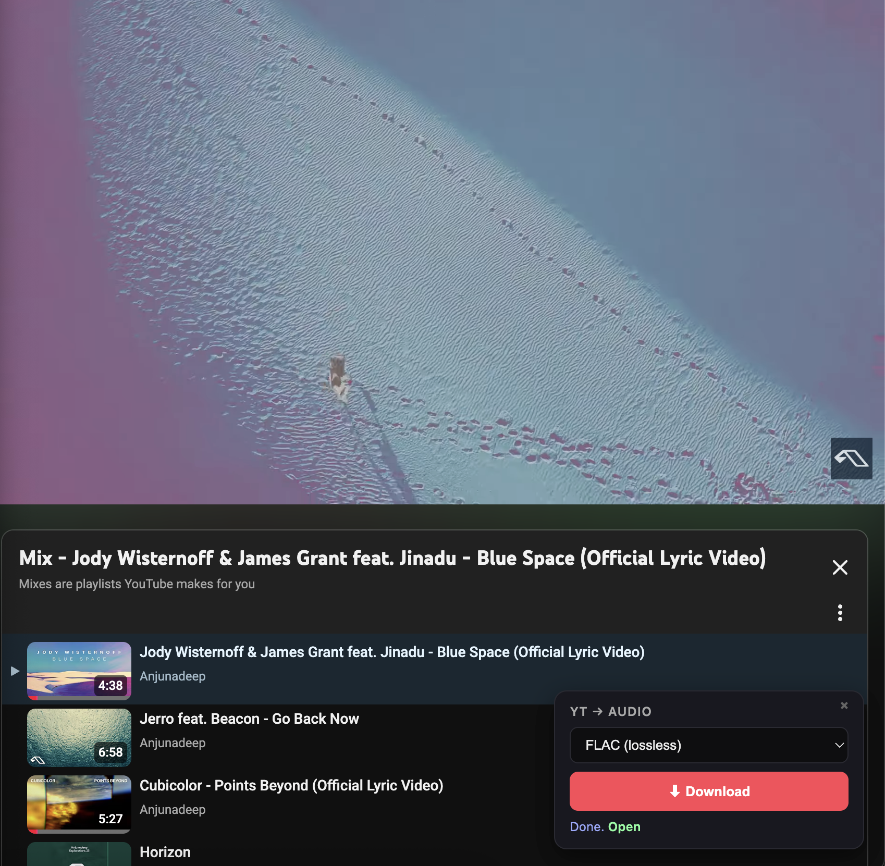

# YouTube Audio Downloader

Local Python backend + Chrome extension for downloading YouTube audio as **MP3**, **FLAC**, **M4A**, or **Opus**. No paywall, no remote API — everything runs on your machine.



## Components

- **`app.py`** — Flask backend. Search YouTube, download via `yt-dlp`, transcode via `ffmpeg`. Optional native window via `pywebview`.
- **`extension/`** — Chrome MV3 extension. Injects an overlay on `youtube.com/watch` pages with a format picker and download button. Talks to the local backend over HTTP.
- **`templates/index.html`** — Standalone web UI for search + preview + download (used by the native window or browser).

## Requirements

- Python 3.10+
- `ffmpeg` (Homebrew: `brew install ffmpeg`)
- Chrome / Chromium for the extension
- macOS / Linux / Windows (tested on macOS)

## Setup

```bash
git clone <this-repo>
cd youtubedownloader
python3 -m venv .venv
.venv/bin/pip install -r requirements.txt
```

## Run

### Native desktop window (pywebview)

```bash
.venv/bin/python app.py
```

### Web mode (browser tab + extension)

```bash
.venv/bin/python app.py --web
# open http://127.0.0.1:5005
```

## Chrome extension

1. Start the backend in `--web` mode (above).
2. Open `chrome://extensions`, enable **Developer mode**.
3. **Load unpacked** → select the `extension/` folder.
4. Visit any `youtube.com/watch?v=...` page. A floating panel appears bottom-right.
5. Pick format → click **Download** → file save dialog opens when ready.

The overlay re-injects on YouTube SPA navigation. Format choice is persisted in `chrome.storage`.

## API

| Method | Endpoint              | Body / Query                              | Returns                              |
|--------|-----------------------|-------------------------------------------|--------------------------------------|
| GET    | `/search?q=<query>`   |                                           | `{ results: [{id, title, ...}] }`    |
| GET    | `/stream/<videoId>`   |                                           | `{ url, title }` — direct audio URL  |
| POST   | `/download`           | `{ "id": "<videoId>", "format": "mp3" }`  | `{ job_id }`                         |
| GET    | `/status/<jobId>`     |                                           | `{ status, progress, filename, ... }`|
| GET    | `/file/<jobId>`       |                                           | the audio file                       |
| GET    | `/playlist?url=<spotifyUrl>` |                                    | `{ name, tracks: [...] }` — Spotify playlist preview |
| POST   | `/playlist/download`  | `{ "url": "<spotifyUrl>", "format": "mp3" }` | `{ playlist_id, name, count }`   |
| GET    | `/playlist/status/<plId>` |                                       | `{ status, progress, tracks: [...] }`|
| GET    | `/playlist/zip/<plId>` |                                          | zip of all completed tracks          |
| GET    | `/config`             |                                           | `{ download_dir, default, env }`     |
| POST   | `/config`             | `{ "download_dir": "<path>" }` or `{ "reset": true }` | updated `{ download_dir }` |

Supported formats: `mp3` (192k), `flac` (lossless), `m4a` (passthrough), `opus` (passthrough).

## Spotify playlists

Paste any `open.spotify.com/playlist/...` URL into the search box. The backend scrapes the public embed page (no API auth), then runs each track through `ytsearch1` and downloads as your selected format. Click **Save ZIP** when done. Embed page caps at ~100 tracks.

## Download folder

Files default to `./downloads/` next to `app.py`. Override:

- **Env var**: `YTMP3_DOWNLOAD_DIR=~/Music/YT python app.py --web`
- **UI**: click ⚙ Settings, set a path, Save. Persisted in `config.json`.

Filenames: single tracks → `Title.ext`, Spotify tracks → `Artist - Title.ext`. Collisions append ` (2)`, ` (3)`, etc.

To clean up old prefixed files (e.g. `pl0abe5aa726-001-Title.mp3` → `Title.mp3`):

```bash
.venv/bin/python scripts/clean_filenames.py            # dry-run
.venv/bin/python scripts/clean_filenames.py --apply    # rename
```

## Architecture notes

Why a backend at all? Pure Chrome extensions cannot transcode to MP3/FLAC — the browser sandbox has no `ffmpeg`. Hosted services (Tubly etc.) use a paid remote API. This project keeps everything local: extension is a thin UI, backend does the real work.

## Files

```
.
├── app.py                          # Flask backend
├── requirements.txt
├── templates/index.html            # Web UI (search + playlists + settings)
├── scripts/clean_filenames.py      # Strip job-id prefixes from old downloads
├── extension/
│   ├── manifest.json               # MV3
│   ├── content.js                  # Injects overlay panel
│   ├── background.js               # chrome.downloads handler
│   └── overlay.css
├── config.json                     # Persisted download folder (gitignored)
└── downloads/                      # Default output dir (gitignored)
```

## License

Personal use. yt-dlp and ffmpeg have their own licenses.
